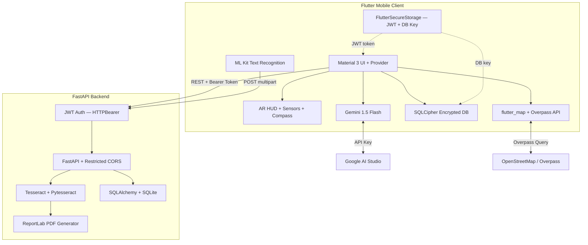
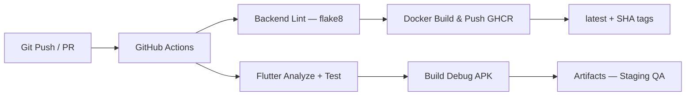
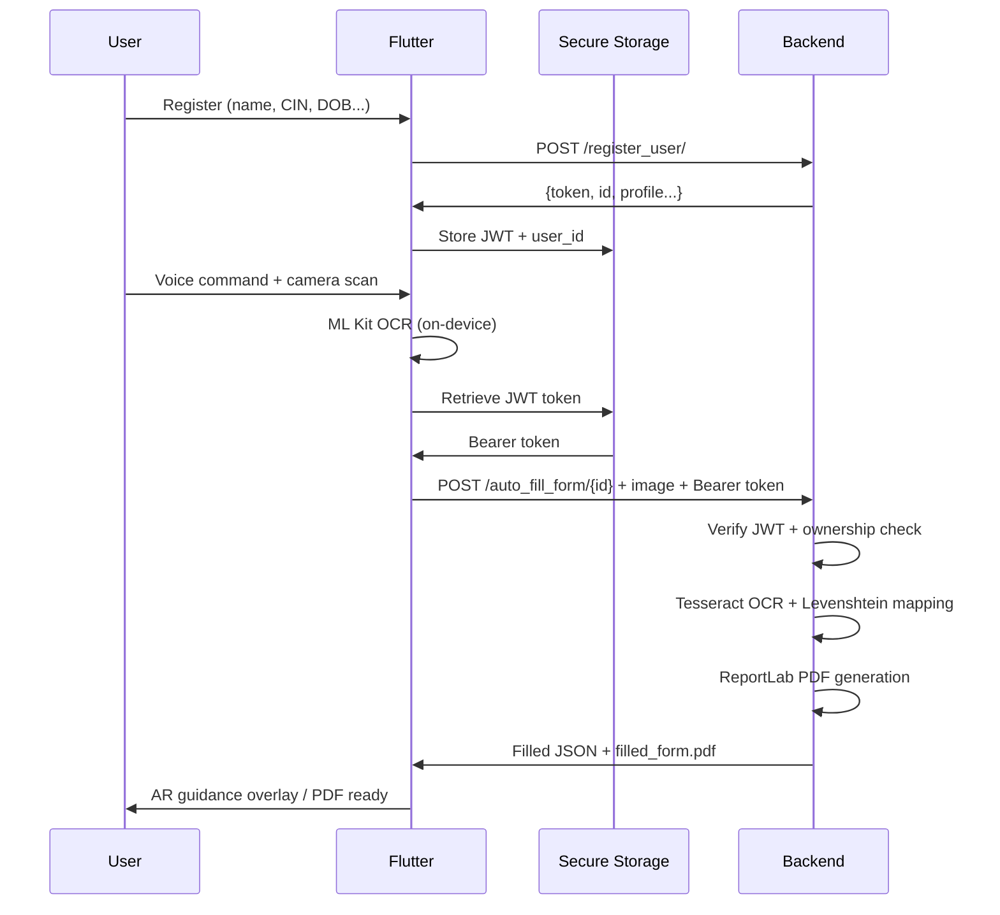

# Maak (معاك) 🤝

**AI-Powered Administrative Accessibility Platform for Tunisia**

[](https://flutter.dev)
[](https://fastapi.tiangolo.com)
[](https://www.docker.com)
[](https://github.com/features/actions)
[](https://dart.dev)
[](https://www.python.org)
[](https://jwt.io)
[](https://www.zetetic.net/sqlcipher/)
[](https://www.openstreetmap.org)
[](LICENSE)

> **Redefining administrative accessibility in Tunisia** through on-device AI, computer vision, AR navigation, intelligent OCR form automation, and predictive analytics — built exclusively for citizens with disabilities.
---

## Table of Contents

1. [Executive Summary](#1-executive-summary)
2. [Problem Statement](#2-problem-statement)
3. [Core Features](#3-core-features)
4. [Technical Architecture](#4-technical-architecture)
5. [Full Project Structure Breakdown](#5-full-project-structure-breakdown)
6. [Tech Stack](#6-tech-stack)
7. [DevOps & Infrastructure](#7-devops--infrastructure)
8. [CI/CD Pipeline](#8-cicd-pipeline)
9. [Installation Guide](#9-installation-guide)
10. [Running the Project](#10-running-the-project)
11. [API Documentation](#11-api-documentation)
12. [AI/ML Components](#12-aiml-components)
13. [Computer Vision / OCR / HUD / Advanced Features](#13-computer-vision--ocr--hud--advanced-features)
14. [Security Architecture](#14-security-architecture)
15. [Scalability & Performance Design](#15-scalability--performance-design)
16. [Future Improvements](#16-future-improvements)
17. [Architecture Diagrams](#17-architecture-diagrams)
18. [Deployment Strategy](#18-deployment-strategy)
19. [Contribution Guidelines](#19-contribution-guidelines)
20. [License](#20-license)

---

## 1. Executive Summary

**Maak (معاك)** is a cross-platform Flutter mobile application paired with a FastAPI backend that transforms complex Tunisian administrative procedures into an inclusive, voice-first, AI-assisted experience. The platform targets individuals with disabilities by providing linguistic support (Standard Arabic, French, Tunisian Darija), cognitive simplification of legal processes, physical AR navigation inside government offices, automated OCR-driven form filling, and predictive office-visit optimization.

**Mission**: Eliminate physical, linguistic, and cognitive barriers in Tunisia's administrative ecosystem (CIN, CNAM, passport, birth certificates, etc.), delivering measurable improvements in accessibility and efficiency.

**Business Value**: Reduces average procedure completion time by leveraging on-device edge AI and cloud-backed services; enables hands-free interaction; generates legally compliant PDFs; and crowdsources real-time office density data.

| | |
|---|---|
| **Target Users** | Tunisian citizens with visual, motor, or cognitive disabilities; elderly users; non-native Arabic/French speakers |
| **Primary Use Cases** | Procedure guidance, office navigation via AR HUD, automated form digitization, best-visit-time prediction |

---

## 2. Problem Statement

Tunisian administrative offices require citizens to navigate complex multi-step procedures, physical queues, printed forms in non-inclusive fonts, and language barriers — challenges that are exponentially harder for people with disabilities. Traditional solutions lack real-time guidance, voice interaction, or automation.

**Maak** solves this by combining **on-device computer vision**, **generative AI**, **AR sensor fusion**, and **backend OCR/PDF services** into a single mobile platform that works offline for core navigation and online for advanced AI features.

---

## 3. Core Features

| Feature | Technical Implementation | Purpose |
|---|---|---|
| **Generative AI Assistant** | `google_generative_ai` (Gemini 1.5 Flash) + `ProcedureDetectionService` with zero-shot prompting + `LanguageProvider` + `speech_to_text` / `flutter_tts` | Voice-first intent detection for 8+ procedures (CIN, CNAM, etc.); real-time Arabic/Darija/French translation and step-by-step guidance |
| **AR & Computer Vision Navigation** | `CVNavigationScreen` using `camera`, `CustomPaint` HUD, `sensors_plus`, `flutter_compass`; linear interpolation (lerp factor 0.15); 1200ms hysteresis; `math.atan2` for directional arrows | Indoor office localization with real-time radar, crosshair, and scanlines; eliminates physical stress of wayfinding |
| **Predictive Visit Optimizer** | `OptimizerService` with blended scoring: `Score = (HistoricalData × 0.6) + (UserFeedback × 0.4)`; procedure-specific time-tax multipliers; `HeatmapGrid` widget | Predicts lowest-density time slots across Tunisian work week; reduces wait times via crowdsourced feedback |
| **Intelligent Form Automation** | Frontend: `google_mlkit_text_recognition` + `image_picker`; Backend: `pytesseract` + Levenshtein mapping + `reportlab` PDF generation; `auto_fill_form/{user_id}` endpoint | Scans physical forms → extracts fields → auto-fills with `UserProfile` → returns print-ready `filled_form.pdf` |

---

## 4. Technical Architecture

**Pattern**: Hybrid client-server monolith with edge AI. Flutter mobile client (thick client) communicates with FastAPI backend via REST. On-device AI (ML Kit, sensors, Gemini) minimizes latency; backend handles heavy OCR/PDF and persistent storage.

| Layer | Details |
|---|---|
| **Frontend** | Flutter (Dart) → Material 3 UI, Provider state management, SQLCipher encrypted local DB (`sqflite_sqlcipher` + `flutter_secure_storage`) |
| **Backend** | FastAPI (Python 3.11) → SQLAlchemy ORM + SQLite (extendable to PostgreSQL), Pydantic schemas, JWT authentication (`PyJWT`), restricted CORS middleware |
| **Authentication** | JWT Bearer tokens issued at registration, enforced on all sensitive endpoints via `HTTPBearer` + ownership verification |
| **Database** | Dual — AES-256 encrypted SQLite on-device (Flutter, via SQLCipher) + SQLAlchemy backend (shared `UserProfile`) |
| **AI Layer** | On-device (ML Kit Text Recognition, sensors) + Cloud (Gemini 1.5 Flash via API key) |
| **Maps** | `flutter_map` + CartoCDN dark tiles + Overpass API (Tunis bbox) + pre-seeded accessible landmarks |
| **Communication** | REST (JSON) with `Authorization: Bearer <token>` headers; direct sensor/camera streams for AR/OCR |

**Data Flow**:

```
User → Flutter UI → (local AI or REST) → FastAPI → (Tesseract + ReportLab) → Response/PDF
```

---

## 5. Full Project Structure Breakdown

```
Maak/
├── .github/
│   └── workflows/
│       └── main_ci.yml          # CI/CD: lint, analyze, test, Docker build-push, APK staging
├── .env                         # GEMINI_API_KEY + BACKEND_URL — NOT committed to VCS
├── .env.example                 # Template for required environment variables
├── .pre-commit-config.yaml      # Pre-commit hooks (linting, secret detection)
├── docker-compose.yml           # Orchestrates backend service in dev/prod
├── pubspec.yaml                 # Flutter dependencies & asset declarations
├── pubspec.lock                 # Locked dependency versions
├── assets/
│   └── images/                  # App icons, onboarding illustrations
├── backend/                     # Self-contained FastAPI microservice
│   ├── Dockerfile               # python:3.11-slim + Tesseract OCR system install
│   ├── requirements.txt         # Python deps (FastAPI, PyJWT, pytesseract, reportlab…)
│   ├── main.py                  # REST endpoints + JWT auth + OCR/PDF logic
│   ├── models.py                # SQLAlchemy ORM models (UserProfile table)
│   ├── schemas.py               # Pydantic request/response validation schemas
│   ├── crud.py                  # Database CRUD operations
│   ├── database.py              # SQLAlchemy engine + session factory
│   ├── config.py                # Backend configuration (JWT secret, DB URL)
│   ├── pdf_handler.py           # ReportLab PDF generation utilities
│   └── test_main.py             # pytest test suite for API endpoints
└── lib/                         # Flutter application source code
    ├── main.dart                # App entry point — MaterialApp, Provider tree, routing
    ├── screens/
    │   ├── accessible_map.dart          # Tunis accessibility map (flutter_map + Overpass)
    │   ├── ai_form_screen.dart          # OCR form scanning + auto-fill with JWT auth
    │   ├── office_finder_screen.dart    # AR-ready office finder with route polylines
    │   ├── profile_creation_screen.dart # User registration + backend sync
    │   └── cv_navigation_screen.dart    # AR HUD with sensor fusion
    ├── core/
    │   ├── database/database_helper.dart  # SQLCipher encrypted DB singleton
    │   └── providers/                     # LanguageProvider, AccessibilityProvider
    ├── services/                # OptimizerService, ProcedureDetectionService
    ├── models/                  # Dart data models (UserProfile, BestSlot, ProcedureStep)
    └── utils/                   # AR math helpers, HUD CustomPaint painters
```

> Other top-level directories: `test/`, `android/`, `ios/`, `web/`, `windows/`, `macos/`, `linux/`

**Key files:**

| File | Role |
|---|---|
| `docker-compose.yml` | Defines production-like backend runtime with volume mounts and env vars |
| `backend/main.py` | All REST endpoints, OCR orchestration, PDF generation logic |
| `pubspec.yaml` | Declares `google_mlkit_text_recognition`, `sensors_plus`, `google_generative_ai`, etc. |
| `lib/screens/cv_navigation_screen.dart` | AR HUD implementation with camera + compass + gyroscope fusion |
| `lib/services/OptimizerService` | Blended scoring algorithm for visit-time prediction |

---

## 6. Tech Stack

| Category | Technologies |
|---|---|
| **Frontend** | Flutter 3.16+, Dart, Material 3, Provider, `google_fonts`, `intl` |
| **Backend** | FastAPI, Uvicorn, SQLAlchemy, Pydantic, PyJWT |
| **Authentication** | JWT Bearer tokens (HS256), `HTTPBearer` dependency injection |
| **AI / ML** | Google Gemini 1.5 Flash, Google ML Kit Text Recognition, Tesseract OCR v5+ |
| **Computer Vision / AR** | `camera`, `sensors_plus`, `flutter_compass`, `CustomPaint`, `math.atan2` |
| **Maps & Navigation** | `flutter_map`, `latlong2`, CartoCDN dark tiles, Overpass API, `geolocator` |
| **Database** | SQLCipher AES-256 (Flutter), SQLite via SQLAlchemy (backend) |
| **Security** | `flutter_secure_storage` (Keystore/Keychain), SQLCipher, JWT, restricted CORS |
| **DevOps** | Docker, Docker Compose, GitHub Container Registry (GHCR) |
| **CI/CD** | GitHub Actions (`flake8`, `flutter analyze`, `flutter test`, Docker build-push) |
| **Testing** | `flutter_test` (3 tests, CI-enabled), `pytest` (backend) |
| **Deployment** | Docker images, GHCR, ready for Kubernetes / Cloud Run |
| **Utilities** | `path_provider`, `permission_handler`, `reportlab`, `pillow`, `flutter_dotenv` |

---

## 7. DevOps & Infrastructure

**Docker Strategy**: Full containerization of the Python backend only — Flutter remains a native mobile build. The Dockerfile uses `python:3.11-slim` as base, installs system-level `tesseract-ocr` and development libraries, copies `requirements.txt`, and launches via `uvicorn main:app --host 0.0.0.0 --port 8000`.

**`docker-compose.yml`:**

```yaml
version: '3.8'
services:
  backend:
    build:
      context: ./backend
      dockerfile: Dockerfile
    ports:
      - "8000:8000"
    environment:
      - TESSERACT_PATH=/usr/bin/tesseract
    volumes:
      - ./backend:/app
    restart: always
```

**Networking**: The Flutter client calls `http://10.0.2.2:8000` on Android emulator or the host machine IP on physical devices. The volume mount (`./backend:/app`) enables hot-reload without container rebuilds during development. The compose file has a PostgreSQL service commented out, signaling readiness for production-grade DB migration.

**Why Docker?** Ensures identical Tesseract OCR environment across development, CI, and production — eliminating OCR accuracy regressions caused by OS-level library version drift.

---

## 8. CI/CD Pipeline

**File**: `.github/workflows/main_ci.yml`

**Triggers**: `push` to `main`/`dev`, `pull_request` to `main`

| Job | Steps | Depends On |
|---|---|---|
| `backend-test` | Setup Python 3.11 → `pip install` → `flake8` (E9, F63, F7, F82, complexity ≤ 10) | — |
| `flutter-test` | Flutter 3.16 stable → `flutter pub get` → `flutter analyze` → `flutter test` | — |
| `build-docker-backend` | Login GHCR → `docker/build-push-action` (tags: `latest` + commit SHA) | `backend-test` |
| `build-staging-apk` | `flutter build apk --debug` → Upload artifact | `flutter-test` |

> **Test Coverage**: Static analysis + automated widget/unit tests (3 passing) + Docker build verification. Production deployment to Cloud Run / Kubernetes is ready via tagged images.

---

## 9. Installation Guide

### Prerequisites

- Flutter SDK ≥ 3.4.3
- Python 3.11+
- Docker + Docker Compose *(recommended)*
- Tesseract OCR v5+ *(only needed for local backend without Docker)*
- Google Gemini API key

### Environment Variables

```bash
cp .env.example .env
```

Edit `.env` with your actual values:

```env
GEMINI_API_KEY=your_real_api_key_here
DATABASE_URL=sqlite:///./test.db
BACKEND_URL=http://127.0.0.1:8000
```

> **Never commit `.env`.** The `flutter_dotenv` package loads these at runtime.
> - Android emulator: use `BACKEND_URL=http://10.0.2.2:8000`
> - Desktop/web: use `BACKEND_URL=http://127.0.0.1:8000`

### Docker Setup *(Recommended)*

```bash
git clone https://github.com/ben-slimene-nour-el-houda/Maak.git
cd Maak
docker-compose up --build
```

Backend available at `http://localhost:8000` — Swagger UI at `http://localhost:8000/docs`

### Local Setup *(without Docker)*

```bash
# Backend
cd backend
pip install -r requirements.txt
uvicorn main:app --reload --port 8000

# Frontend (separate terminal)
flutter pub get
flutter run --debug
```

> **Permissions required**: Camera, location, and device sensor access must be granted on the physical device or emulator.

### CI/CD Secrets (for Cloud Run deployment)

Required GitHub secrets if deploying to Cloud Run:

- `GCP_SA_KEY`
- `GCP_PROJECT`
- `GCP_REGION`

If not configured, the deploy step is skipped and the rest of the CI pipeline still runs.

---

## 10. Running the Project

### Development Mode

```bash
# Terminal 1 — Backend (hot-reload via volume mount)
docker-compose up --build

# Terminal 2 — Flutter
flutter run
```

### Production Mode

```bash
# Mobile builds
flutter build apk --release   # Android
flutter build ipa              # iOS

# Backend (detached)
docker-compose up -d
```

---

## 11. API Documentation

**Base URL**: `http://localhost:8000`
**Swagger UI**: `/docs` *(FastAPI auto-generated)*
**Authentication**: JWT Bearer tokens (HS256), issued at registration
**CORS**: Restricted origin whitelist *(configurable via environment)*

| Method | Endpoint | Auth | Purpose |
|---|---|---|---|
| `GET` | `/` | Public | Health check |
| `POST` | `/register_user/` | Public | Create user + issue JWT |
| `POST` | `/user_profiles/` | Public | Add profile (alternate route) |
| `GET` | `/get_user_profile/{user_id}` | Bearer + ownership | Retrieve own profile |
| `POST` | `/scan_form/` | Bearer | OCR field extraction from image |
| `POST` | `/auto_fill_form/{user_id}` | Bearer + ownership | Full OCR → auto-fill → PDF |

> **Ownership enforcement**: Endpoints with `{user_id}` verify that the JWT subject matches the path parameter — users can only access their own data.

---

## 12. AI/ML Components

| Component | Model / Algorithm | Role |
|---|---|---|
| **Gemini 1.5 Flash** | Zero-shot prompting via `google_generative_ai` | Intent classification across 8+ administrative procedures; multilingual conversational guidance (AR/FR/Darija) |
| **Google ML Kit Text Recognition** | On-device neural OCR | Real-time form field extraction with no internet dependency; low-latency edge inference |
| **Tesseract OCR v5+** | LSTM-based backend OCR via `pytesseract` | Production-grade extraction with custom training potential for Tunisian administrative fonts |

> No custom-trained models are used. The platform relies on pre-trained foundation models for deployment speed and long-term maintainability.

---

## 13. Computer Vision / OCR / HUD / Advanced Features

### AR HUD (`CVNavigationScreen`)

- `CustomPaint` renders real-time radar overlay, precision crosshair, and CRT-style scanlines
- Movement smoothing via `lerp(factor: 0.15)` — prevents jitter from sensor noise
- Target persistence via a **1200ms hysteresis window** — avoids flickering when targets briefly leave frame
- Direction calculation: `math.atan2(dy, dx)` applied to fused gyroscope + compass heading data

### OCR Pipeline

```
User scans form (camera)
        │
        ▼
ML Kit Text Recognition (on-device, offline)
        │
        ▼
Image → POST /scan_form/ or /auto_fill_form/{user_id}
        │
        ▼
Tesseract OCR (backend, python:3.11 + tesseract-ocr)
        │
        ▼
Levenshtein fuzzy field matching → UserProfile mapping
        │
        ▼
ReportLab PDF generation → filled_form.pdf
        │
        ▼
JSON response + PDF returned to Flutter client
```

### Indoor AR Navigation

Combines live camera feed + `flutter_compass` heading + `sensors_plus` gyroscope data for indoor localization **without external beacons, Bluetooth, or Wi-Fi fingerprinting**.

---

## 14. Security Architecture

| Layer | Measure |
|---|---|
| **Authentication** | JWT Bearer tokens (HS256) via `PyJWT` — issued at `/register_user/` |
| **Authorization** | `get_current_user_id` dependency — ownership verification on all `{user_id}` endpoints |
| **CORS** | Restricted origin whitelist (no wildcard `*`) |
| **Local database** | SQLCipher AES-256 encryption (`sqflite_sqlcipher`) |
| **DB key management** | Auto-generated key stored in `flutter_secure_storage` (Keystore/Keychain) |
| **Token storage** | JWT + `user_id` persisted in platform-native secure storage |
| **Session persistence** | `SharedPreferences` `hasAccount` flag — skips re-registration on re-launch |
| **Device permissions** | Granular runtime consent via `permission_handler` |
| **Environment secrets** | `flutter_dotenv` loads `.env` at runtime — `.gitignore`-protected |
| **Input validation** | FastAPI Pydantic schemas on all request bodies |
| **Pre-commit hooks** | Gitleaks secret scanning + linting via `.pre-commit-config.yaml` |
| **PDF persistence** | Generated server-side, not stored permanently |
| **HTTPS** | TLS termination via reverse proxy in production |

---

## 15. Scalability & Performance Design

**Current state**: Single-container FastAPI + SQLite — appropriate for MVP scale. Flutter runs natively on-device with no server dependency for core AR/navigation features.

**Horizontal scaling readiness**: GHCR-hosted Docker image supports multi-replica deployment behind any load balancer. Stateless FastAPI design (no in-memory session state) enables horizontal pod autoscaling.

**Planned optimizations:**

| Optimization | Impact |
|---|---|
| PostgreSQL migration | Production-grade concurrent writes and ACID compliance |
| Redis caching for `OptimizerService` | Eliminates redundant scoring computation across users |
| GPU-accelerated Tesseract containers | 5–10× OCR throughput improvement |
| Flutter web/desktop kiosk mode | Deployment at government terminals |
| Gemini Nano (on-device) | Full offline AI capability without API dependency |

---

## 16. Future Improvements

- Offline-first AI via Gemini Nano
- PostgreSQL for production-grade persistence
- Redis caching layer for optimizer scores
- Flutter kiosk mode for government terminal deployment
- Prometheus + Grafana observability dashboard
- Expanded language support and procedure coverage

---

## 17. Architecture Diagrams

### System Architecture



### DevOps Pipeline



### Request / Data Flow



---

## 18. Deployment Strategy

| Environment | Method |
|---|---|
| **Development** | `docker-compose up --build` + `flutter run` |
| **Staging** | GitHub Actions debug APK artifact + GHCR image (`latest`) |
| **Production** | Push to `main` → CI tags image with commit SHA → deploy to Cloud Run / ECS / Kubernetes |
| **Mobile distribution** | Google Play Store / Apple App Store / Enterprise MDM |

**Zero-downtime**: Blue-green deployment via Docker image tags + container health checks.

**Cloud Run example:**

```bash
gcloud run deploy maak-backend \
  --image ghcr.io/Yassminefeki/maak-backend:latest \
  --platform managed \
  --region europe-west1 \
  --allow-unauthenticated \
  --port 8000
```

---

## 19. Contribution Guidelines

Contributions are welcome!

1. **Fork** the repository
2. **Create a branch**: `git checkout -b feature/your-feature-name`
3. Ensure `flutter analyze` and `flake8` pass with zero errors
4. **Add or update tests** for all changed logic
5. **Open a Pull Request** with a clear description, updated Mermaid diagrams if architecture changed, and a reference to the related issue (`#issue-number`)

**Code style**: Official Flutter lints + PEP 8, both enforced by the CI pipeline.

**Local CI simulation:**

```bash
# Backend
cd backend && flake8 . --max-complexity=10

# Frontend
flutter analyze
```

---

## 20. License

This project is licensed under the **MIT License** — see the [LICENSE](LICENSE) file for details.

---

<div align="center">

*Built with ❤️ for a more inclusive Tunisia.*

**معاك — Because no one should face bureaucracy alone.**

**Repository**: [github.com/ben-slimene-nour-el-houda/Maak](https://github.com/ben-slimene-nour-el-houda/Maak)

</div>
